# Sliceman

[](https://github.com/dashuaigc/Sliceman/releases/latest)
[](https://github.com/dashuaigc/Sliceman/releases)
[](https://developer.adobe.com/photoshop/uxp/)
[](LICENSE)

**为 UI、游戏美术和设计师打造的 Photoshop 批量效率工具。**

Sliceman 是一款基于 Photoshop UXP 开发的生产力插件，专门解决日常设计工作中大量重复、机械的图层操作。

无需反复整理图层、逐个改名、手动排列或一个个导出资源。通过 Sliceman，可以直接在 Photoshop 中完成：

- **[智能切图](#九切图)** —— 按图层、组和颜色标记自动批量导出资源
- **[批量改尺寸](#八批量修改图片尺寸)** —— 一批图片统一改尺寸，四步向导，支持多尺寸同时输出
- **[批量重命名](#一批量重命名)** —— 替换、重新命名、前后缀、连续编号，实时预览结果
- **[智能分割](#智能分割)** —— 自动识别同一图层中的独立元素，并拆分为多个图层
- **[参考线分割](#参考线分割)** —— 按画布上已有的参考线把内容切成网格，每格一个图层
- **[批量智能对象](#批量转智能对象)** —— 多个图层分别转换为独立智能对象，不会被合并
- **[批量新建组](#批量新建独立组)** —— 为每个选中图层或组分别建立独立父级组
- **[一键排版](#五一键排版)** —— 自动识别元素空间顺序，按指定方向、对齐方式和间距快速排列
- **[快速平移](#四快速平移)** —— 八个方向精确移动多个对象，可选复制移动
- **[快速绘制表格](#六快速绘制表格)** —— 填行列尺寸即出矢量表格，可选整张一层或每格一层
- **[参考线助手](#七参考线助手)** —— 一键唤起 PS 原生「新建参考线版面」，建过的版面自动记录，下次一键重放

减少重复点击，把 Photoshop 中原本需要几十次操作的工作压缩成一次操作。

特别适合：

**游戏 UI / App UI / 网页设计 / 图标整理 / 美术资源切图 / PSD 规范化 / 批量素材处理**

> 给图层做好标记，剩下的交给 Sliceman。

**[⬇ 下载最新版 .ccx](https://github.com/dashuaigc/Sliceman/releases/latest)** —— 双击安装，重启 Photoshop 即可使用。

## 插件截图

面板左侧竖排九个功能入口（图标 + 名称），各对应一个功能页，启动默认停在「重命名」；设置钮在功能栏底部。顶栏（品牌 + 版本号）与底部状态栏固定不动，只有右侧内容列滚动。

### 九个功能页

| 重命名 | 数字编号 n | 分割 | 批处理 |
|:---:|:---:|:---:|:---:|
|  |  | 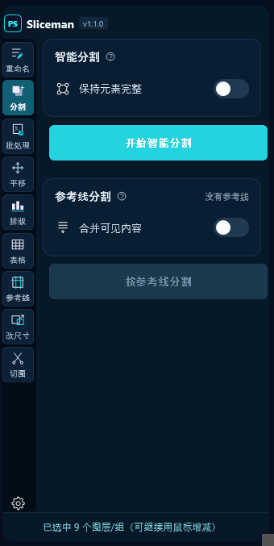 | 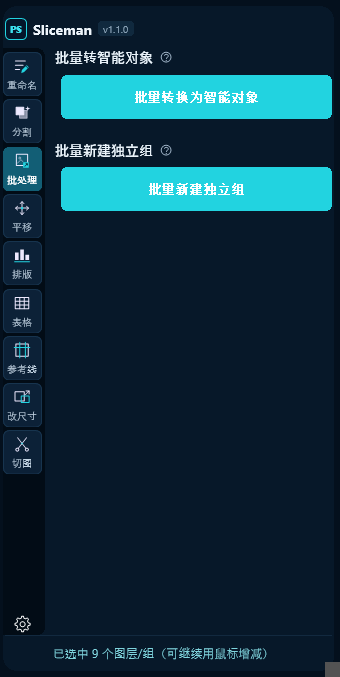 |
| 四种改名方式，实时预览 | 起始 / 递增 / 位数 / 方向 | 智能分割与参考线分割并列 | 转智能对象 / 建独立组 |

| 平移 | 排版 | 表格 | 参考线 |
|:---:|:---:|:---:|:---:|
| 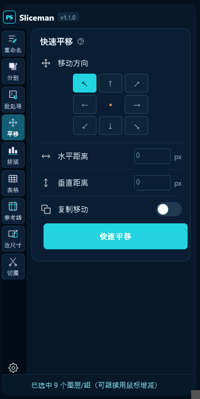 | 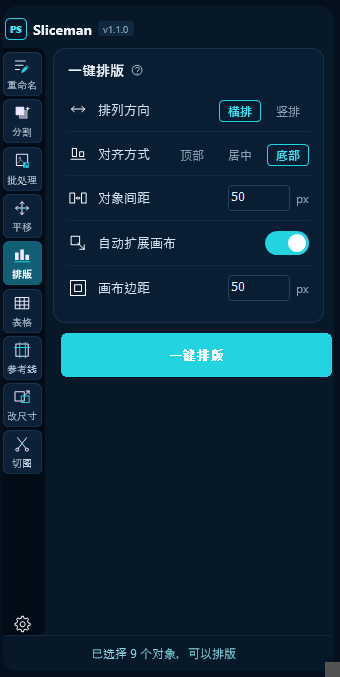 | 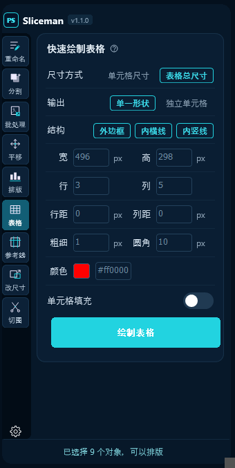 | 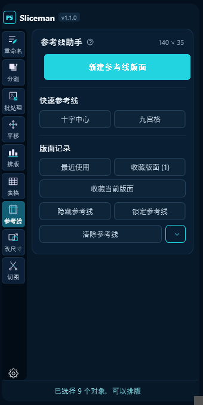 |
| 九宫格选方向，方向决定填几个值 | 方向 · 对齐 · 间距 · 扩画布 | 行列尺寸填完直接出矢量表格 | 原生弹窗 + 版面记录与收藏 |

| 切图 | 按名称查找 · 查找页 | 按名称查找 · 查找项页 |
|:---:|:---:|:---:|
| 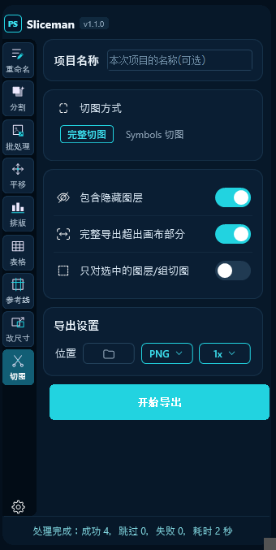 | 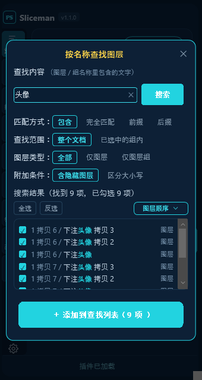 | 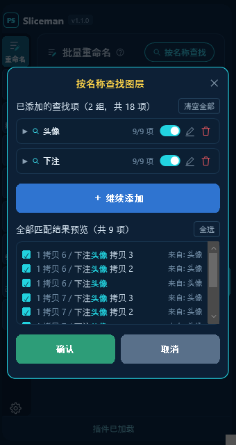 |
| 完整切图与 Symbols 两套规则 | 边打字边出结果，默认全部勾选 | 一个关键词一张卡片，可叠加多批 |

### 改尺寸：四步向导

| ① 选图片 | ② 尺寸设置 | ③ 输出设置 | ④ 开始处理 |
|:---:|:---:|:---:|:---:|
| 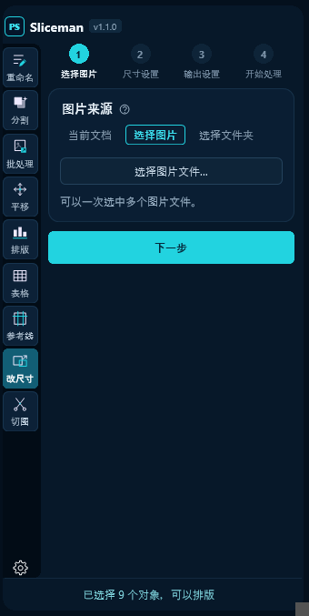 | 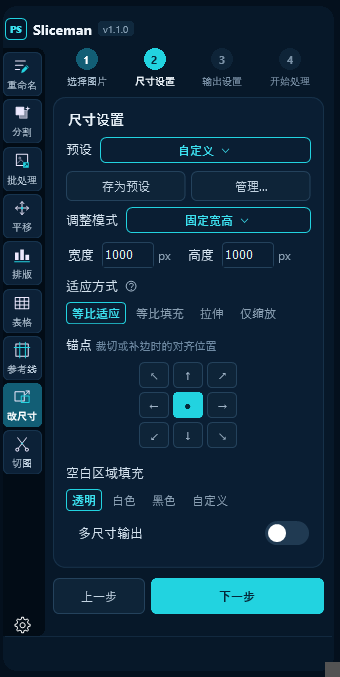 | 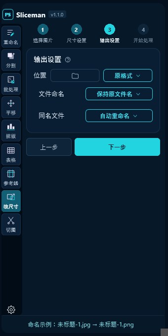 | 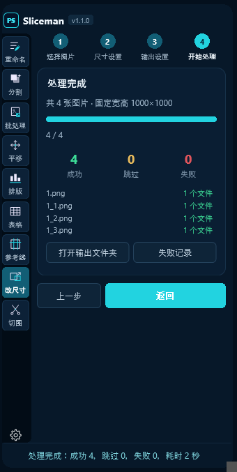 |
| 多选图片 / 整个文件夹 / 当前文档 | 八种模式 · 四种适应 · 锚点 · 多尺寸 | 位置 · 格式 · 命名 · 同名策略 | 成功 / 跳过 / 失败三个数 + 逐条日志 |

---

## 一、批量重命名

对**在图层面板选中**的图层 / 组批量改名，**只改你真正点亮的那些**：

- 点亮的全是组 → 只改组名，组里的层一个都不动
- 点亮的是组 + 图层 → 组名和图层名各按规则改一次
- 点亮的全是图层 → 只改这些图层名

想让组内的层也改，就把它们一起点亮（组名和组内层各改自己的，编号顺序按面板从上往下：组名在前，组内的层紧随其后）。

预览里每行**行首带类型图标**：黄色文件夹 = 组，蓝色图片框 = 图层，一眼能看出这一行改的是组名还是层名。选中项超过 300 个时预览只画前 300 行、末尾注明还有多少（UXP 下 DOM 一大就卡）—— **只是预览省略，应用重命名时全部生效**。

**按名称查找图层**：手点太慢时，点「批量重命名」标题右侧的「按名称查找」开弹窗，把**整个文档**（或已选中的组内）名称匹配的图层一次性选出来 ——

- 匹配方式：包含 / 完全匹配 / 前缀 / 后缀；查找范围：整个文档 / 已选中的组内；图层类型：全部 / 仅图层 / 仅图层组
- 附加条件：区分大小写；含隐藏图层（眼睛关掉的层也找，**默认勾选**）
- 最底下那个「背景」图层一并查出来并标「背景」—— 注意给它改名，Photoshop 会顺手把它转成普通图层
- 填好关键词按回车或点「搜索」即查（边打字也会实时出结果）；在 PS 里增删过图层后，回车 / 点搜索即按当前条件重查一遍
弹窗分两步：

1. **查找页** —— 标题行给出「找到 N 项，已勾选 M 项」；命中的层实时列出（带所在路径、高亮的命中片段、图层 / 图层组 / 背景 / 隐藏 / 锁定标注），**默认全部勾选**，可点行取消、可全选 / 反选，右上角的下拉可切「图层顺序 / 按名称」（默认图层顺序，只影响看的顺序）。点「＋ 添加到查找列表」把这一批收成一张小卡片。
2. **查找项页** —— 列出所有卡片：放大镜 + 关键词、命中数、启用开关、编辑与删除两个图标钮，**默认折叠**，点头上的 ▶ 展开后是条件摘要与**已勾选**的名字（只占一行，装不下的折成 `+N`，点名字可单独取消；要把取消掉的勾回来走「编辑」）；「清空全部」一次清掉。下方是**全部匹配结果预览**：跨卡片按图层去重，点某行就从所有卡片里取消它，「全选」再全勾回来。

点「继续添加」回到查找页换关键词再查一批，**多个关键词就是多张卡片**；攒够了点「确认」，预览里的层一次性成为图层面板的当前选中、弹窗关闭，重命名预览随即更新，**之后照旧能用鼠标继续增减选中**。点「取消」或右上角 ✕，这次查找的内容全部作废，选中不受影响。

**四种方式**

| 方式 | 行为 |
|---|---|
| 替换 | 把原名里的「查找内容」换成新文字；没匹配到的原样不动 |
| 重新命名 | 整个名称直接换掉 |
| 前缀 | 在原名前面拼接 |
| 后缀 | 在原名后面拼接 |

**连续编号**：打开「数字编号 n」后，模板里**单独的字母 `n`** 会被替换成连续数字 —— `Button`、`Icon` 里的 n 不算。可设置：

- 起始数字、递增数字（如 `Button_n` + 起始 3 + 递增 2 → `Button_3`、`Button_5`、`Button_7`…）
- 数字位数 1–4 位，不足补 0
- 命名方向：沿图层面板从上到下 / 从下到上

**预览**实时显示「原名称 → 新名称」，重名会标出 `⚠同名`。新旧名相同、替换后为空、未匹配到的行都不会写回 PS。整批合并为一条历史，Ctrl+Z 一步撤销。

---

## 二、分割

同一页里两个功能并列：切线由**算法猜**（智能分割）还是由**你画**（参考线分割）。两者都只产出新图层，原对象保持不变，可放心撤销。

### 智能分割

选中**一个像素图层**（拼合的素材图 / 多元素图层），自动识别其中互不相连的内容块，把每一块复制成独立图层，按从上到下、每行从左到右依次命名为 `0`、`1`、`2`…

**保持元素完整**（开关，默认关）

- **关**：严格按像素是否相连拆分 —— 字母 `i` 的点会单独成为一层
- **开**：先闭合 ≤6px 的抗锯齿裂缝，再按本图推导的自适应阈值把靠得很近的连通块并回同一图层；规则排列的字符表 / 雪碧图会被识别为**网格**，按格拆分而不做合并

**按像素分，不按外框分**：互不相连的两个元素，外框却常常互相交叠 —— 一个人物伸出的手臂正好罩在另一个人物的裙摆上方，一个 `C` 形直接把另一个圆点整个圈在自己的外框里。这种情况下按外框整块复制，每一层都会被切进邻居的一块（看着就像"沿直线横竖切"）。所以每一块的选区都是按它**自己占的像素**拼出来的，交叠区里属于别人的像素一个都不会进来。

### 参考线分割

用**当前文档里已有的参考线**把内容切成网格，每一格复制成一个独立图层。参考线怎么来的不限 —— 手拖的、PS 原生「新建参考线版面」建的、本插件参考线功能建的都行。

- **画布边缘算作外边界**：3 条竖线 = 4 列；只拖竖线就切成整条的列，只拖横线就切成整条的行
- 整格没有内容的**自动跳过**，切出来的图层按 `0`、`1`、`2`… 依次编号（从上到下、每行从左到右），并**统一放进一个新组**
- 标题行右侧实时显示当前参考线切出几块（如 `4 列 × 3 行 → 12 块`）；没有参考线时按钮置灰
- 块数超过 40 会先问一句 —— 每块都要走一轮复制粘贴，块多了明显变慢
- 默认切**选中的那一个图层 / 组**（文字 / 形状 / 智能对象也可以，切出来的都是像素）；开启**合并可见内容**则不看选中，把整张可见画面拍平后切
- 参考线坐标以**标尺原点**为基准（与 PS 原生「新建参考线版面」一致）：在 PS 里拖动过标尺原点会让切线整体偏移
- 撤销可能需要按几次 Ctrl+Z（本流程没有合并成一条历史）

---

## 三、批量处理

同一页里两个功能并列，都作用于图层面板中**最外层的选中项**（选中组时组作为整体参与，不会连它的子图层一起算）。

### 批量转智能对象

选中的图层**逐个**转换为独立智能对象 —— 绝不把多个图层合并进同一个智能对象（这正是 PS 原生「转换为智能对象」的行为）。已是智能对象的自动跳过。图层名称、顺序、位置、所在组与视觉效果全部保持不变。

### 批量新建独立组

为**每一个**选中对象分别新建一层父级组并把它嵌套进去 —— 选中几个就建几个组，绝不合并。新组沿用原对象名称，建在对象原来的父级、原来的位置上：图层顺序、所在组、组内结构、名称、样式、混合模式、不透明度、蒙版与智能对象属性全部不变。无法处理的对象（如背景图层）会被跳过并在结果里报出。

---

## 四、快速平移

所有选中对象朝**同一个方向、同一个偏移量整体平移**，对象之间的相对位置、排列关系完全不变。

**方向从九宫格里点一个**，八个方向任选；中间那个点只是原点标记，表示「从这里往外走」。要填几个值由方向决定：

| 方向 | 要填的值 |
|---|---|
| ← → | 只填**水平距离** |
| ↑ ↓ | 只填**垂直距离** |
| ↖ ↗ ↙ ↘ | **水平 + 垂直**两个值 |

用不到的那一行会自己收起来，它的值也不参与计算 —— 选「向右」时哪怕垂直框里还留着上次的 30，也只往右走，不会斜着跑。

- **相对位移**，不是绝对坐标：不需要指定左上角 / 中心点之类的基点
- 距离**留空即为 0**；填**负数**自动转成正数并翻到对面那个方向（`→` 填 `-20` 变成 `← 20`；斜向只翻填了负数的那一个轴，`↖` 的水平填 `-20` 就变成 `↗`）
- 框内按 **Enter** 直接执行；**↑/↓** 加减 1px，**Shift+↑/↓** 加减 10px
- 数值执行后不清零，连点即可**累加**；走过头就点一下反方向那一格再移一次
- 选中父组和它的子图层时自动**去重**，只移动父组，子图层不会走出双倍距离
- 锁定图层与背景图层自动跳过，不影响其余对象
- 允许移动到画布外，**不会自动改变画布尺寸**

**复制移动**（开关，默认关）：开启后原对象**留在原位**，移动的是新复制出来的那一份 —— 等于 PS 里按住 Alt 拖，但距离是精确的。副本移完仍是当前选中，可以接着再按同一距离挪一份，做等距阵列很顺手。整次操作（复制 + 平移）在历史记录里仍是一步。

---

## 五、一键排版

选中 2 个以上对象，按横向或竖向自动排成一排。

**智能空间排序** —— 顺序不看图层面板，按对象在画布中的实际位置：

- 横排：先从上到下识别「行」，行内从左到右
- 竖排：先从左到右识别「列」，列内从上到下

行列识别用 **Bounds 重叠比**（重叠超过自身一半即归为同一带）而不是坐标相等，所以顶边不齐、高度差异大的真实素材也能正确归行。没有明显行列结构的散乱对象也会给出稳定、可复现的顺序。

**间距是相邻对象的真实边缘距离**，不是中心距。带投影 / 外发光的图层优先按主体边界（`boundsNoEffects`）计算，避免空出一大截。

**锚点保持原位**：排序后的第一个对象（横排＝最上一行的最左，竖排＝最左一列的最上）不动，其余依次贴过去，整批版面不会漂走。

| 设置 | 可选值 | 默认 |
|---|---|---|
| 排列方向 | 横排 / 竖排 | 横排 |
| 对齐方式（横排） | 顶部 / 居中 / 底部 | 底部 |
| 对齐方式（竖排） | 左侧 / 居中 / 右侧 | 左侧 |
| 对象间距 | 0–9999 px | 10 px |
| 自动扩展画布 | 开 / 关 | 关 |
| 画布边距 | 0–9999 px | 10 px |

横排与竖排**各自记忆**上次用的对齐方式。开启「自动扩展画布」后，只向真正超出的方向扩展并留出「画布边距」（与对象间距是两个独立参数）；关闭时允许对象留在画布外，不动画布。

> 位移一律取整 —— 像素图层做小数位移会被重采样发虚。游标按取整后的实际落位推进，误差不沿链累积，每段间距与设定值最多差 1px。

> **锁定图层会中止排版**并提示解锁（插件不擅自解锁）。这一点与快速平移不同：那边是跳过锁定层继续，这边排一半再报错会留下更难收拾的现场。

---

## 六、快速绘制表格

填好行列与尺寸，一键在当前文档画出**矢量形状**表格 —— 不是像素、不是选区，画完颜色、大小、圆角都能继续改。

表格画在**当前视图的正中间**：放大到局部工作时，表格就出现在眼前，而不是跑到画布中心去。读不到视图信息时自动退回画布居中。

**两种输出方式**

| 输出 | 结果 |
|---|---|
| 单一形状 | 整张表格的线条合成一个形状图层（开启单元格填充时再加一层填充，两层套一个组） |
| 独立单元格 | 每格一个独立矩形图层，命名 `R1C1`、`R1C2`…，放进一个组；描边与填充是两套独立属性，可以同时存在 |

**相邻格子共用一条边** —— 独立单元格模式下每格自带内侧描边，紧挨着排会让两条 1px 描边并成 2px，比外边框粗一倍。插件把相邻矩形**重叠一个线宽**，两条描边落在同一列像素上，内部线与外边框都是 1×粗细。「表格总尺寸」模式下重叠量会被补回去，画出来的整体宽高仍精确等于填入的数值。

**结构开关**（外边框 / 内横线 / 内竖线，可多选）只对单一形状模式有效，独立单元格模式下自动置灰。行距或列距**大于 0** 时格子之间本就断开，单一形状模式会自动从连续表格线切换成「每格一个描边环」。

| 设置 | 可选值 | 默认 |
|---|---|---|
| 尺寸方式 | 单元格尺寸 / 表格总尺寸 | 单元格尺寸 |
| 输出 | 单一形状 / 独立单元格 | 单一形状 |
| 结构 | 外边框 · 内横线 · 内竖线 | 三项全开 |
| 宽 / 高 | > 0 px | 100 / 100 |
| 行 / 列 | 正整数 | 3 / 3 |
| 行距 / 列距 | ≥ 0 px | 0 / 0 |
| 粗细 | > 0 px | 1 px |
| 圆角 | ≥ 0 px | 0 px |
| 颜色 | 十六进制 / 点色块开拾色器 | 前景色，取不到则 `#000000` |
| 单元格填充 | 开 / 关 | 关 |
| 填充 | 十六进制 / 点色块开拾色器 | `#cccccc` |

切换尺寸方式时两个数值框**自动换算** —— 从「单元格尺寸」切到「表格总尺寸」会填入算好的总宽高，反之亦然，不用自己心算。

> **输入框的取值模型**：当前值以灰字提示显示，点进去框自动清空可直接输入，按 **Enter** 确认并退出输入框；点进去没改就移开，仍保持进来时的数值（这一套现在是**全插件通用**的，见下方「输入框通用行为」）。整页设置跨会话记忆。

> 形状图层超过 500 个时会先弹窗确认，避免几千格把 PS 拖死。整次绘制在历史记录中为一步，Ctrl+Z 一次撤销。

> **已知限制**：独立单元格画出的矩形是路径形状，Photoshop 属性面板里**改不了圆角**（`keyOrigin*` 这类实时形状元数据对脚本只读，写不进去）。要改圆角就在面板里改好参数重画。状态栏会明确回报本次是不是实时形状。

---

## 七、参考线助手

给 Photoshop 原生「新建参考线版面」补上它缺的那件事 —— **把建过的版面记下来**：

> 在原生弹窗里建一次 → 插件自动记录 → 下次点「应用」一键重放

不用再反复回忆和重填列数、列宽、装订线、四边边距。

### 新建参考线版面

参数**一个都不在面板里**。点面板上的 **新建参考线版面**，打开的就是 **Photoshop 自己的弹窗**（和「视图 > 新建参考线版面」完全同一个）：

- 列 / 行 / 数量 / 宽度 / 高度 / 装订线 / 边距 / 列居中 / 清除现有的参考线，全在弹窗里填；
- 勾上弹窗里的**预览**就能边改边看；
- **点「确定」才创建**，**直接关掉弹窗则文档里什么都不留**。

> **打开时的初值**：和你手动点菜单打开时**一模一样** —— 首次是 Photoshop 的出厂默认，之后每次都自动带出**上一次确定的设置**。想用更早建过的某一版，去下面的「最近使用 / 收藏版面」点「应用」。

### 版面记录

弹窗点了确定之后，插件会把这一版写进「最近使用」，存的就是**你在弹窗里填的那一版**。创建成功后状态栏报一句摘要（如 `已创建参考线版面：6列 / 8行`），完整参数在记录里看。

「最近使用」和「收藏版面」两个入口**并排一行**，按钮上带条数（如 `最近使用 (5)`），点开各自的弹窗列出全部记录 —— 每条显示摘要、完整参数、创建时画布尺寸与时间，右侧是操作按钮。

| 弹窗 | 每条的操作 |
|---|---|
| 最近使用 | **应用** / **☆ 收藏**（已收藏显示 ★，再点取消）/ **删除**；底部有「清空历史」（二次确认） |
| 收藏版面 | **应用** / **改名** / **删除** |

- 最近使用保留 **20 条**并自动去重 —— 参数完全相同的不会堆成多条，而是把原记录提到最前；
- **应用**不弹窗，直接重放那一版；
- 收藏可自定义名称（最长 24 字），不受 20 条上限影响；
- 删除记录**只删插件里的数据，不会动文档里的参考线**。

记录里的摘要**列 / 行 / 边距三块都会写出来**，没设的那块明写「未设置」，例如 `列 未设置；行 5 · 高度自动 · 装订线 0px；边距 未设置` —— 不用点开也知道那一版到底设了什么。

**跨尺寸复用**：记录里存的是「自动」宽高时，应用到别的画布上会**按当前画布重新计算**；存的是固定值则照原值创建。所以同一套版面能在 1920 和 2560 的稿子上通用。

> 「列」要生效，弹窗里**「数字」必须填**：只勾上「列」、只填装订线而数字留空，Photoshop 建出来的就是 0 列，记录里自然是「列 未设置」。行同理。

> 弹窗里可以按像素 / 百分比 / 厘米填写，插件统一折算成像素保存（百分比按画布尺寸、物理单位按文档分辨率折算）。

> 没走插件按钮、自己去菜单里建的那一版不一定会自动进记录 —— 想留下它，用下面的 **收藏当前版面**。极少数情况下这一版的参数读不出来，状态栏会**如实说明本次没有记录**，不会编一条不准的进去。

### 收藏当前版面

两个入口下面还有一个 **收藏当前版面** 按钮：把当前文档里**已经画好**的参考线整套存进收藏，不用照着重建一遍 —— 别人给的源文件、很久以前建的版面、临时调出来的一套线，都能直接收下。

- 能认出规则（几列几行 / 装订线 / 边距）就**按参数存**，之后应用到别的尺寸会重算，和普通收藏完全一样；
- 认不出来的（手摆的、拼出来的）就**按原坐标存成快照**，列表里显示成 `纵 8 条 / 横 4 条 · 自定参考线 · 按原坐标重放`，应用时逐条还原（不缩放：位置是当初挑的，缩了就不是那一版了；画布尺寸和当初不同会在状态栏注明）；
- 不管哪种，**坐标都会一起存下来**：应用时若画布尺寸和收藏时一样，就按坐标原样还原，保证「和收藏时看到的一模一样」；换了尺寸的稿子才用参数重算。这一步是必要的 —— 有些版面用 PS 的版面参数表达不出来，比如「4 列 + 左右边距、没有横线」只能存成「边距 上0 下0 左100 右100」，而这套参数在 PS 里还会多画出画布上下两条边线；
- 同一套线重复收藏只提示「已经在收藏里了」，不会堆出第二条；文档里一条参考线都没有时也只提示。

### 快速参考线

| 按钮 | 生成 |
|---|---|
| 十字中心 | 垂直 50% + 水平 50% 两条中线 |
| 九宫格 | 横竖各三等分，共四条 |

这两个不经过弹窗、点了直接建，恒为**追加**，不会清掉已排好的版面；与已有参考线重合的位置自动跳过，连点也不会堆出重复线。它们不是「版面」，不进记录。

### 参考线控制

**显示 / 隐藏**（只改显示状态，不删数据）、**锁定 / 解锁**（防止在画布上误拖）、**清除参考线**（下拉可选：全部 / 仅横向 / 仅纵向）。

> 所有操作只作用于**当前激活文档**，切换文档后自动跟着切；没有打开文档时按钮整体置灰并提示。参考线坐标以**标尺原点**为基准（与 PS 原生行为一致）。插件自己做的创建 / 清除在历史记录中为一步，Ctrl+Z 一次撤销。

---

## 八、批量修改图片尺寸

把一批图片统一改成同一套尺寸。四步向导走完即可：**选图片 → 设尺寸 → 设输出 → 开始处理**。

底部的「上一步 / 下一步」之外，**顶上那排 1234 也能直接点**，前后都行、跨步也行。**四步之间随便切，不设卡** —— 哪一步都可能是回头补设置的。校验只在点「开始批量修改」时做一次：缺东西就跳到缺东西的那一步，并报出「第几步 + 缺什么」。处理中不换页（那会儿得盯着进度和「停止处理」）。

两条底线：**默认不改原文件**（一律另存到新位置）、**默认不让图变形**。
单张失败不中断整批，跑完在「失败记录」里看原因。

### ① 图片来源

| 来源 | 说明 |
|---|---|
| 选择图片（默认） | 一次多选若干图片文件（JPG / PNG / WEBP / PSD / TIFF / BMP） |
| 选择文件夹 | 扫描整个文件夹，可选**包含子文件夹** |
| 当前文档 | 处理当前打开的这一个 |

选好之后下面列出**已选清单**，一行一个文件名（长名压成「头…尾」）：一次露 5 行，更多的滚动看。

> **来源是当前文档时，处理的是复制出来的临时副本，原文档一个像素都不碰。**

> 「选择图片」的系统对话框里会**列出全部文件**，不按扩展名过滤 —— UXP 在 Windows 上对这个过滤器的处理不可靠，加了过滤就可能一个图片都看不见。挑完之后插件自己按扩展名筛，不是支持的格式会被忽略并如实报出个数。

> 「包含子文件夹」拨一下就地重扫**已经选好的那个文件夹**，不会再弹一次文件夹选择框。

> 不支持把文件拖进面板 —— UXP 面板没有接收操作系统文件拖放的接口，HTML 的拖拽事件拿不到文件路径。

### ② 尺寸设置

**八种调整模式**

| 模式 | 行为 |
|---|---|
| 固定宽高 | 给定 W×H，具体怎么装由下面的「适应方式」决定 |
| 固定宽度 / 固定高度 | 只给一边，另一边按原比例算 |
| 最长边 / 最短边 | 自动认横竖：4000×3000 配「最长边 2048」→ 2048×1536，竖图反之 |
| 百分比缩放 | 25% / 50% / 75% / 150% / 200% 快捷或手填 |
| 尺寸倍数 | 0.5x ~ 4x 快捷或手填 |
| 最大尺寸限制 | 没超限就原样保留，超了才等比缩进限制框内 |

**四种适应方式**（只有「固定宽高」才谈得上；面板上四个按钮排一行，说明在「适应方式」后面的 **?** 里，鼠标移上去就出来）

| 方式 | 图像 | 画布 |
|---|---|---|
| 等比适应 | 缩进目标框内 | = 目标框，空白按填充色补齐 |
| 等比填充 | 放大到铺满目标框 | = 目标框，超出部分按锚点裁掉 |
| 拉伸 | 强行拉成目标尺寸（**会变形**） | = 目标框 |
| 仅缩放 | 缩进目标框内 | 跟着图走，不补边也不裁切 |

裁切 / 补边时用**九宫格锚点**决定从哪边裁、往哪边补（默认居中）；等比适应的空白区域可选**透明 / 白 / 黑 / 自定义色**（默认透明）。

> 面板上**没有**「锁定宽高比」这个开关：批量场景里不存在「原始比例」这个单一值（每张图比例都不同），比例行为完全由上面四种适应方式决定。

**小图一律放大到目标**：512×512 配「1024×1024 等比适应」就输出 1024×1024。
（面板上曾有「不放大 / 放大 / 跳过」三选一，实际用起来只会让人困惑 —— 选了 1024 却输出 512 —— 已撤掉入口。）

**多尺寸输出**（仅固定宽高）：一次出多档尺寸。两种加法混着用，都能加任意多档：

- **填宽高点「添加」**：加的是一档**绝对尺寸**，走上面那套适应方式 / 锚点 / 填充。那一行有自己的宽 / 高输入框（默认带出上面填的那一档），改一改再点一次就是下一档 —— 不用回上面改主尺寸。
- **按原图倍率添加**：加的是一档**倍率**，基准是每张原图自己的尺寸（`@2x` 就是「这张图的两倍」），所以同一档对横图竖图各出各的尺寸，等比缩放、不补边。倍率框里填几个就按几个加，如 `1,2,3` 或 `0.5,1,2`；中英文逗号、分号、空格都能当分隔符；一次最多 8 档、单档不超过 20 倍 —— 每档都要重新缩放并存一次盘，档数一多就是把一批拖成半小时。

命名自动带上算出来的实际尺寸，互不覆盖（想要 `icon@2x` 这种名字，用命名模板里的 `{scale}`）。**一个文件只打开一次**（靠历史快照回退），不会重开三遍。

**尺寸预设**：内置几套常用的，也可以把当前参数「存为预设」，之后一键应用；支持改名与删除。
套预设之前你自己那套参数会先被收起来，下拉里**选回「自定义」就原样还原**（模式和参数区一起回来）；没套过预设时点「自定义」什么都不动。手动改了调整模式，下拉的名字自动回到「自定义」。

重采样算法交给 PS 自动挑（面板不再给这个选项）。

### ③ 输出设置

**位置**和**输出格式**在同一行，跟切图的「导出设置」一个样子：

- **位置**：默认不选 —— 每张图存回**它自己所在的那个文件夹**，不新建目录。点那个文件夹图标可以指定一个目录，所有图都存到那儿；指定之后图标换成文件夹名，下面给一个「改回原文件夹」退回默认。两种状态各是什么意思、**现在到底输出到哪儿**（指定了就报完整路径），都在「输出设置」后面的 **?** 里，鼠标移上去就出来 —— 页面上不再为这段话单占一行。
- **输出格式**：默认**原格式**，下拉可指定 PNG / JPG / WebP / PSD / TIFF。JPG 与有损 WebP 可设质量 1–100（注：PS 的 JPG 质量实际只有 12 档，面板的 1–100 会换算过去）。WebP 默认无损（保留透明）。

文件夹来源 + 指定了位置时可选**保持原文件夹结构**（`UI/Icon/a.png` → `输出/Icon/a.png`）。
输出位置**不跨会话记忆**（文件夹入口拿不回来），重开面板回到「原文件所在位置」这个默认。

> **来源是当前文档时必须指定一个位置** —— UXP 的文件权限按「用户亲手选中的入口」授予，插件拿不到一个已打开文档所在的磁盘目录，问号浮层第一行会直接说「还没指定」并让你去点文件夹图标。多选图片时手里也只有文件入口，得按路径反查父目录（manifest 里声明了 `localFileSystem: fullAccess`）。

> 反查父目录用的 `getEntryWithUrl` 对 `file:` 的写法**极其挑剔且各版本不一致**：官方示例是单斜杠的 `file:/D:/img`，Windows 上有报告说分隔符原样的 `file:/D:\img` 才认，也有写法一个斜杠都不加（`file:D:/img`）；双斜杠的 `file://D:/img` 是最常见的错法（`//` 后那段被当成主机名）。所以插件**几种写法挨个试**，带空格 / 中文时再补一份 encodeURI 的。全都不行才报「定位不到原文件所在目录」，并**把每一次的原话都列出来**（不是只报最后一条），末尾还附一条判断：连原文件自己都解析不到就更像是 `fullAccess` 没生效 —— 权限是**装载插件时**读的，刚更新过插件却没重新加载（UDT 里 Remove → Add，再重启 PS），报的就是这一类。绕开的办法始终是点「位置」的文件夹图标指定一个目录。

> **扫描时自动跳过输出目录**：「包含子文件夹」是递归扫描，输出文件夹要是就在源目录里面，不排除的话第二次运行会把上次的产物再处理一遍，越跑越多。跳过了哪些目录会如实报出来。

**文件命名**：保持原文件名 / 添加后缀 / 自定义模板（`{name}` `{width}` `{height}` `{scale}`）。
**同名文件**：自动重命名（`a_2.png`、`a_3.png`…）/ 覆盖 / 跳过。

改这两项时**命名示例**实时报在**底部状态栏**（这一页里不再单占一行 —— 那一行放不下真机上那些四十多字的文件名），两边都压成「头…尾」。

### ④ 开始处理

刚进来这一步的标题是「**准备就绪**」。进度条 + 当前文件 + **成功 / 跳过 / 失败**三个数 + 逐条处理日志。处理中可**停止**（已经存好的文件都保留，不回滚）。

跑完可「打开输出文件夹」（「原文件所在位置」这条路也能开。UXP 自己打不开文件夹，插件走的是 Photoshop 自带的脚本引擎 —— 见下面「已知约束」；万一连这条也不通，状态栏会把每一条拒绝的理由列出来，并**把完整路径复制到剪贴板**，粘到资源管理器地址栏就到了）、查看「失败记录」—— 有失败就列出**文件名 + 原因**，一条失败都没有也会明说「这一批没有失败的文件」，不会点了没反应。

跑完后这一步的标题变成「**处理完成**」，底部的「开始批量修改」变成「**返回**」—— 点它回到第 1 步，**上一批选好的图片一并清空**，免得以为还是那一批。
「上一步」一直留着：回去改了任何参数，再回到第 4 步时按钮自动变回「开始批量修改」（上一批的结果不作数了）。

外部文件的尺寸不打开文档是读不到的，所以任务预览只报张数，不预先声称「有几张会被跳过」；
来源是当前文档时才在标题行显示 `1920×1080 → 1024×576 / 画布 1024×1024`。

### 已知限制

- 撤销：处理外部文件不产生历史记录（文件处理完就关掉了），已生成的文件需要自己删；来源是文档时也不改原文档，所以没什么要撤的。
- 「修改并覆盖原文件」这一版没做（默认只输出新文件）。
- DPI（分辨率）与「只改分辨率不重采样」这一版没做。
- 横图 / 竖图 / 正方形分别设置这一版没做。
- 16 位 / CMYK 图能改尺寸，但 WebP 只吃 8 位 RGB，这类文件存 WebP 会失败并计入「失败」。

---

## 九、切图

### 完整切图

默认把当前文档每个叶子图层切成独立图片（紧贴像素裁切、带透明）。

**颜色标记规则**：图层 / 组标**红色** → 不切；标**蓝色** → 合并为一张。优先级 红 > 蓝 > 默认。

蓝色分两种，都是「合成一张」：

| 标蓝的是 | 行为 | 文件名取自 |
| --- | --- | --- |
| **组** | 整组合并为一张（组内红色图层 / 红色子组自动排除） | 组名 |
| **图层** | **同一层级下**标蓝的图层全部合并为一张 | 这几层里**最下面**那一层的名字 |

「同一层级」= 同一个组（或同在画布根）下的兄弟层。**不看顺序**：中间隔着没标蓝的层照样合，被隔开的那层自己单独切一张。想分两拨合并就把它们放进不同的组。只有孤零零一个图层标蓝时就是它自己一张，和不标蓝没区别。

这一轮本来就不导出的层（红色，或隐藏且没开「包含隐藏图层」）不进合并，但也不影响其余蓝层合到一起。

文件名取最下面那层，是因为 PS 里复制出来的副本都摞在原件上面 —— 最下面那个通常就是没带「拷贝 2」的原名。合并出来的那张图就排在这一层原来的位置上。

开着「只对选中的图层 / 组切图」时，**点中参与合并的任意一层，整张合并图都会导出**（合并的结果是一张图，不会只切一半）。

**命名**：`[项目名_]组名(逐层)_图层名`，`_` 分隔（**不含 PSD 文件名**）。

开着「只对选中的图层 / 组切图」时，**路径从你点的那一项算起**，它上面的各级组名不进名：

| 你在图层面板点了什么 | 文件名（`Btn_Group` 组里有 `icon_1`） |
|---|---|
| 只点组里的 `icon_1`，没点组 | `icon_1` —— 填了项目名则 `Proj_icon_1` |
| 点的是 `Btn_Group` 组本身 | `Btn_Group_icon_1` |

（完整切图不受影响，仍是从文档根逐层进名。）

每一段按下面的规则转成文件名：

| 原字符 | 结果 |
|---|---|
| 英文字母 / 数字 / 下划线 | **原样保留**（大小写不动、下划线不动）—— `WG_effect_8` 就叫 `WG_effect_8` |
| 中文 | 每个字取拼音首字母（小写）—— `图标_关闭` → `tb_gb` |
| 空格、`-`、`.`、括号等其它字符 | 删除 |

本次运行内重名自动加 `_2`/`_3`（**只差大小写也算重名** —— Windows 下 `A.png` 和 `a.png` 是同一个文件）；目标文件夹已存在同名文件时**逐个询问**覆盖 / 跳过，并可选「全部覆盖」「全部跳过」。

> **Symbols 切图用完全相同的规则**（`[项目名_]组名(逐层)`，组名即图标名）。只有把「定位格」直接放在画布根时路径一段都不剩 —— 那种情况下文件名取固定的 `symbol`，同样不掺 PSD 名。

### Symbols 切图

给每个图标组加一个名称含「**定位格**」的参考图层，按定位格摆放图标。导出时以定位格为基准框：未超出则按定位格尺寸导出，超出则自动补足空白像素，确保图标居中。定位格本身不参与切图，隐藏后仍可识别。

### 导出设置

| 项 | 可选值 | 默认 |
|---|---|---|
| 包含隐藏图层 | 开 / 关 | 开 |
| 完整导出超出画布部分 | 开 / 关 | 开 |
| 只对选中的图层 / 组切图 | 开 / 关 | 关 |
| 格式 | PNG / JPG / WebP / GIF / BMP | PNG |
| 倍率 | 0.25 / 0.5 / 1 / 2 / 3 / 5 / 10 x | 1x |
| 位置 | 点文件夹图标预选 | 未设置时导出前弹窗 |

**完整导出超出画布部分**：开 → 导出前先把画布扩到装得下这一张的所有像素，图层伸出画布外的那部分照样导出；关 → 保持原画布，溢出的部分被裁掉。

⚠️ 这一步必须排在合并图层**之前**：Photoshop 合并图层时会直接丢弃画布外的像素，合并完再扩画布就没得救了（真机踩过，开着开关也只导出画布内那一块）。

⚠️ 但**不能用 Photoshop 的 Reveal All 来扩** —— 它连**隐藏**图层也算进去。真机实测：200×200 的画布里放一个被挪到 (3000,3000) 且已隐藏的层，Reveal All 把画布撑到 3080×3080。而切图用的工作文档装着整个 PSD 的图层（只是把非目标层隐藏），用 Reveal All 就等于**每导出一张都把画布撑到覆盖全 PSD**，后面的合并与 trim 全在这张巨图上做 —— 这是切图变得奇慢的真因（而且这个开关默认是开的，人人都在走）。现在改成只按「这一轮真会合并的那些层」的并集算目标矩形（`src/lib/export-core.js` 的 `computeBleedRect`，有单测），再用 `doc.crop()` 扩过去：crop 到画布外会补透明，等价于一次「只针对目标」的 Reveal All，画布始终是紧的。

### 中途控制

切图过程中主按钮变红，点它或按 **ESC** 可暂停并询问「终止 / 继续」。选择终止会关闭遗留的临时文档、切回原文档并恢复到切图前的历史状态。

---

## 十、设置的记忆范围

| 记忆多久 | 项 |
|---|---|
| **跨会话**（localStorage） | 一键排版全部设置；快速平移的方向；快速绘制表格全部设置；参考线助手的最近使用 20 条 + 收藏版面 |
| **本次会话**（PS 开着期间，关闭 PS 后清空） | 项目名称、导出位置 |
| **不记忆**（每次打开面板重置） | 快速平移的两个距离 —— 默认为空即 0px，面板打开期间输入的值会留在框里以便连点累加；快速平移的「复制移动」开关 —— 它会凭空多出图层，每次打开都从关着开始 |

> **参考线的版面参数不由插件保存**：它们填在 Photoshop 的原生弹窗里，由 PS 自己记住上次的设置。插件保存的是「建过哪些版面」—— 最近使用与收藏版面，点「应用」即可重放。

---

## 开发环境

- Node ≥ 18、npm
- Photoshop 2022+（UXP manifest v5，manifest 里 `host.minVersion` 为 23.3.0）
- [Adobe UXP Developer Tool (UDT)](https://developer.adobe.com/photoshop/uxp/2022/guides/devtool/) —— 开发期加载与调试

## 命令

```bash
npm install         # 安装依赖
npm test            # 运行纯逻辑单测（vitest）
npm run test:watch  # 单测 watch 模式
npm run build       # 打包出可加载的插件目录 dist/plugin/
npm run pack        # build + 打成可双击安装的 dist/Sliceman_vX.Y.Z.ccx
npm run icons       # 重新生成插件 / 面板图标 PNG（含必需的 @1x / @2x 后缀）
npm run install:ps  # build + 直接装进本机 PS 的插件目录
npm run uninstall:ps
```

`npm run build` 会把 `src/ui/panel.js` 打包（内联 pinyin-pro 离线词典，`photoshop` / `uxp` 作为宿主注入保持 external），并把 `manifest.json`、`index.html`、`styles.css`、`icons/` 一起拷进扁平目录 `dist/plugin/`。

## 开发期加载（UDT）

1. `npm run build`
2. UDT → `Add Plugin` → 选 **`dist/plugin/manifest.json`**（是 dist 里的那个，不是 src）
3. `Load` → Photoshop 出现「Sliceman」面板
4. 改代码后重新 `npm run build`，UDT 里点 `Reload`

> **改了 `src/` 一定要先 `npm run build` 再 Reload** —— PS 加载的是 `dist/plugin/`，只改源文件 Reload 读到的还是旧产物。

## 打包成 .ccx 并安装

```bash
npm run pack        # → dist/Sliceman_vX.Y.Z.ccx
```

1. 关闭 UDT 里加载的开发版（避免冲突）
2. **双击 `.ccx`** → Creative Cloud 的 Unified Plugin Installer 弹确认 → 安装
3. 重启 Photoshop → 插件菜单出现「Sliceman」

`scripts/pack.mjs` 在打包前会逐个断言 manifest 声明的图标在 `dist/plugin/` 里真实存在。manifest 里的 `path` 是**模板**不是真文件名 —— PS 会按 `scale` 拼出 `@1x`/`@2x` 去找，少一个后缀就是面板标签空白。

> 双击无反应时：确认已登录 Creative Cloud 桌面端，且 `UnifiedPluginInstallerAgent` 存在
> （通常在 `C:\Program Files\Common Files\Adobe\Adobe Desktop Common\RemoteComponents\UPI\...`）。

## 代码结构

纯逻辑放 `src/lib/*`，在 Node 下用 vitest 覆盖；`src/ps/*` 与 UI 依赖 Photoshop 运行时，只能在 UDT 里对真实 PSD 手动验证。**新功能一律先把可判定的部分抽进 `lib/`。**

| 路径 | 职责 | 单测 |
|---|---|---|
| `src/lib/normalize.js` | 单段规范化（英文/数字/下划线原样 + 中文拼音首字母） | ✅ |
| `src/lib/naming.js` | 文件名拼接 + 占位兜底 + 去重 | ✅ |
| `src/lib/traversal.js` | 图层树遍历，产出导出任务（红 / 蓝 / 默认规则） | ✅ |
| `src/lib/symbols.js` | 定位格识别 + 以定位格为基准的导出框计算 | ✅ |
| `src/lib/rename-core.js` | 批量重命名（四种方式 + n 编号 + 预览行） | ✅ |
| `src/lib/search-core.js` | 按名称查找图层（四种匹配 + 类型 / 隐藏 / 范围过滤 + 命中区间） | ✅ |
| `src/lib/segment.js` | 智能分割（连通域标记 + 自适应合并 + 网格检测 + 逐元素选区矩形） | ✅ |
| `src/lib/guide-split.js` | 参考线分割（参考线 → 网格单元格 + 每格内容的紧贴外框） | ✅ |
| `src/lib/resize-core.js` | 批量改尺寸（八种模式 + 四种适应 + 小图策略 → 目标图像/画布；命名模板与文件名合法化；文件收集判定） | ✅ |
| `src/lib/layout-core.js` | 一键排版（行列识别 + 位移计算 + 画布扩展量） | ✅ |
| `src/lib/move-core.js` | 快速平移（八方向换算 + 输入解析 + 负数归一 + 该方向要填几个值） | ✅ |
| `src/lib/table-core.js` | 绘制表格（单元格排布 + 共边重叠 + 圆角矩形路径点） | ✅ |
| `src/lib/view-core.js` | 视图变换解析 → 当前视图中心 → 表格左上角坐标 | ✅ |
| `src/lib/guide-core.js` | 参考线版面几何 + 坐标去重 + 记录去重与上限 + newGuideLayout 描述符双向映射 + 从参考线反推版面参数 | ✅ |
| `src/ps/layer-tree.js` | 读文档图层树为纯数据（含颜色标记、id） | 手动 |
| `src/ps/exporter.js` | 临时文档 + mergeVisible 隔离 + trim + 存图 | 手动 |
| `src/ps/save-image.js` | 按格式保存文档（切图与改尺寸共用；WebP 走描述符，JPG 质量换算） | 手动 |
| `src/ps/resizer.js` | 递归收集文件 + 静默打开 + imageSize/canvasSize + 多尺寸快照回退 + 关文档 | 手动 |
| `src/ps/renamer.js` | 图层面板顺序读取 + 批量改名写回 | 手动 |
| `src/ps/layer-finder.js` | 读全文档图层为扁平清单（含路径 / 可见性）+ 按 id 批量选中 | 手动 |
| `src/ps/smart-split.js` | 取像素 → 调 segment / guide-split → 各块复制成独立图层（+ 落位校正与编组） | 手动 |
| `src/ps/smart-object.js` | 逐个转独立智能对象 | 手动 |
| `src/ps/group-maker.js` | 逐个套父级组 | 手动 |
| `src/ps/layouter.js` | 读 Bounds → 调 layout-core → 逐个位移 + 扩画布 | 手动 |
| `src/ps/mover.js` | 一条 move 描述符批量平移选区（可选先 duplicate，让副本吃位移） | 手动 |
| `src/ps/layer-lock.js` | 批量读图层锁定状态（排版 / 平移共用） | 手动 |
| `src/ps/table-maker.js` | 路径组件 → 形状图层描述符 + 建组 + 拾色器 + 读视图 | 手动 |
| `src/ps/guides.js` | 播菜单项开原生弹窗 + 静默重放 + 动作通知 + 弹窗前后参考线快照 + 参考线读 / 建 / 清 + 显隐与锁定 | 手动 |
| `src/ui/` | 面板 HTML / CSS / JS | 手动 |
