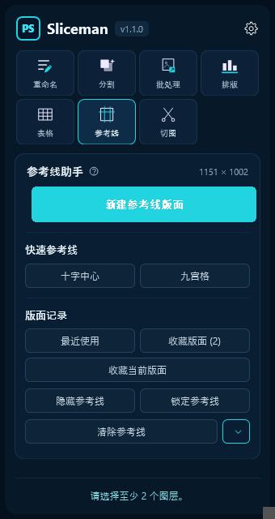

# Sliceman

[](https://github.com/dashuaigc/Sliceman/releases/latest)
[](https://github.com/dashuaigc/Sliceman/releases)
[](https://developer.adobe.com/photoshop/uxp/)
[](LICENSE)

**为 UI、游戏美术和设计师打造的 Photoshop 批量效率工具。**

Sliceman 是一款基于 Photoshop UXP 开发的生产力插件，专门解决日常设计工作中大量重复、机械的图层操作。

无需反复整理图层、逐个改名、手动排列或一个个导出资源。通过 Sliceman，可以直接在 Photoshop 中完成：

- **[智能切图](#七切图)** —— 按图层、组和颜色标记自动批量导出资源
- **[批量重命名](#一批量重命名)** —— 替换、重新命名、前后缀、连续编号，实时预览结果
- **[智能分割](#二智能分割)** —— 自动识别同一图层中的独立元素，并拆分为多个图层
- **[批量智能对象](#批量转智能对象)** —— 多个图层分别转换为独立智能对象，不会被合并
- **[批量新建组](#批量新建独立组)** —— 为每个选中图层或组分别建立独立父级组
- **[一键排版](#四一键排版)** —— 自动识别元素空间顺序，按指定方向、对齐方式和间距快速排列
- **[快速平移](#批量快速平移)** —— 批量按照指定 X / Y 距离精确移动多个对象
- **[快速绘制表格](#五快速绘制表格)** —— 填行列尺寸即出矢量表格，可选整张一层或每格一层
- **[参考线助手](#六参考线助手)** —— 一键唤起 PS 原生「新建参考线版面」，建过的版面自动记录，下次一键重放

减少重复点击，把 Photoshop 中原本需要几十次操作的工作压缩成一次操作。

特别适合：

**游戏 UI / App UI / 网页设计 / 图标整理 / 美术资源切图 / PSD 规范化 / 批量素材处理**

> 给图层做好标记，剩下的交给 Sliceman。

**[⬇ 下载最新版 .ccx](https://github.com/dashuaigc/Sliceman/releases/latest)** —— 双击安装，重启 Photoshop 即可使用。

## 插件截图

面板左侧竖排七个功能入口（图标 + 名称），各对应一个功能页，启动默认停在「重命名」；设置钮在功能栏底部。顶栏（品牌 + 版本号）与底部状态栏固定不动，只有右侧内容列滚动。

| 重命名 | 数字编号 n | 分割 | 批处理 |
|:---:|:---:|:---:|:---:|
|  |  |  |  |
| 四种改名方式，实时预览 | 起始 / 递增 / 位数 / 方向 | 一个开关，默认按连通像素拆 | 转智能对象 / 建组 / 快速平移 |

| 排版 | 表格 | 参考线 | 切图 |
|:---:|:---:|:---:|:---:|
|  |  |  |  |
| 方向 · 对齐 · 间距 · 扩画布 | 行列尺寸填完直接出矢量表格 | 原生弹窗 + 版面记录与收藏 | 完整切图与 Symbols 两套规则 |

---

## 一、批量重命名

对**在图层面板选中**的图层 / 组批量改名。改动只作用于选中项本身：选中一个组改的是组名，不会自己钻进组里去动子图层；但要是你把组和组里的某几层**都点亮了**，那它们就都是选中项，组名和这几个层名会各按规则改一次（编号顺序按面板从上往下：组名在前，组内的层紧随其后）。

**按名称查找图层**：手点太慢时，点「已选中 N 个」那一行右侧的「按名称查找」开弹窗，把**整个文档**（或已选中的组内）名称匹配的图层一次性选出来 ——

- 匹配方式：包含 / 完全匹配 / 前缀 / 后缀；查找范围：整个文档 / 已选中的组内；图层类型：全部 / 仅图层 / 仅图层组
- 附加条件：区分大小写；含隐藏图层（眼睛关掉的层也找，**默认勾选**）
- 最底下那个「背景」图层一并查出来并标「背景」—— 注意给它改名，Photoshop 会顺手把它转成普通图层
- 填好关键词按回车或点「搜索」即查（边打字也会实时出结果）；在 PS 里增删过图层后，回车 / 点搜索即按当前条件重查一遍
弹窗分两步：

1. **查找页** —— 标题行给出「找到 N 项，已勾选 M 项」；命中的层实时列出（带所在路径、高亮的命中片段、图层 / 图层组 / 背景 / 隐藏 / 锁定标注），**默认全部勾选**，可点行取消、可全选 / 反选，右上角的下拉可切「图层顺序 / 按名称」（默认图层顺序，只影响看的顺序）。点「＋ 添加到查找列表」把这一批收成一张小卡片。
2. **查找项页** —— 列出所有卡片：放大镜 + 关键词、命中数、启用开关、编辑与删除两个图标钮，**默认折叠**，点头上的 ▶ 展开后是条件摘要与**已勾选**的名字（只占一行，装不下的折成 `+N`，点名字可单独取消；要把取消掉的勾回来走「编辑」）；「清空全部」一次清掉。下方是**全部匹配结果预览**：跨卡片按图层去重，点某行就从所有卡片里取消它，「全选」再全勾回来。

点「继续添加」回到查找页换关键词再查一批，**多个关键词就是多张卡片**；攒够了点「确认」，预览里的层一次性成为图层面板的当前选中、弹窗关闭，重命名预览随即更新，**之后照旧能用鼠标继续增减选中**。点「取消」或右上角 ✕，这次查找的内容全部作废，选中不受影响。

**四种方式**

| 方式 | 行为 |
|---|---|
| 替换 | 把原名里的「查找内容」换成新文字；没匹配到的原样不动 |
| 重新命名 | 整个名称直接换掉 |
| 前缀 | 在原名前面拼接 |
| 后缀 | 在原名后面拼接 |

**连续编号**：打开「数字编号 n」后，模板里**单独的字母 `n`** 会被替换成连续数字 —— `Button`、`Icon` 里的 n 不算。可设置：

- 起始数字、递增数字（如 `Button_n` + 起始 3 + 递增 2 → `Button_3`、`Button_5`、`Button_7`…）
- 数字位数 1–4 位，不足补 0
- 命名方向：沿图层面板从上到下 / 从下到上

**预览**实时显示「原名称 → 新名称」，重名会标出 `⚠同名`。新旧名相同、替换后为空、未匹配到的行都不会写回 PS。整批合并为一条历史，Ctrl+Z 一步撤销。

---

## 二、智能分割

选中**一个像素图层**（拼合的素材图 / 多元素图层），自动识别其中互不相连的内容块，把每一块复制成独立图层，按从上到下、每行从左到右依次命名为 `0`、`1`、`2`…

原图层保持不变，可放心撤销。

**保持元素完整**（开关，默认关）

- **关**：严格按像素是否相连拆分 —— 字母 `i` 的点会单独成为一层
- **开**：先闭合 ≤6px 的抗锯齿裂缝，再按本图推导的自适应阈值把靠得很近的连通块并回同一图层；规则排列的字符表 / 雪碧图会被识别为**网格**，按格拆分而不做合并

---

## 三、批量处理

同一页里三个功能并列，都作用于图层面板中**最外层的选中项**（选中组时组作为整体参与，不会连它的子图层一起算）。

### 批量转智能对象

选中的图层**逐个**转换为独立智能对象 —— 绝不把多个图层合并进同一个智能对象（这正是 PS 原生「转换为智能对象」的行为）。已是智能对象的自动跳过。图层名称、顺序、位置、所在组与视觉效果全部保持不变。

### 批量新建独立组

为**每一个**选中对象分别新建一层父级组并把它嵌套进去 —— 选中几个就建几个组，绝不合并。新组沿用原对象名称，建在对象原来的父级、原来的位置上：图层顺序、所在组、组内结构、名称、样式、混合模式、不透明度、蒙版与智能对象属性全部不变。无法处理的对象（如背景图层）会被跳过并在结果里报出。

### 批量快速平移

所有选中对象按**同一个 X/Y 偏移量整体平移**，对象之间的相对位置、排列关系完全不变。

- **相对位移**，不是绝对坐标：不需要指定左上角 / 中心点之类的基点
- 距离框**留空即为 0**，该轴不动；填**负数**自动转成正数并翻转方向（`→ -20` 会变成 `← 20`）
- 框内按 **Enter** 直接执行；**↑/↓** 加减 1px，**Shift+↑/↓** 加减 10px
- 数值执行后不清零，连点即可**累加**；走过头就点一下反方向箭头再移一次
- 选中父组和它的子图层时自动**去重**，只移动父组，子图层不会走出双倍距离
- 锁定图层与背景图层自动跳过，不影响其余对象
- 允许移动到画布外，**不会自动改变画布尺寸**

---

## 四、一键排版

选中 2 个以上对象，按横向或竖向自动排成一排。

**智能空间排序** —— 顺序不看图层面板，按对象在画布中的实际位置：

- 横排：先从上到下识别「行」，行内从左到右
- 竖排：先从左到右识别「列」，列内从上到下

行列识别用 **Bounds 重叠比**（重叠超过自身一半即归为同一带）而不是坐标相等，所以顶边不齐、高度差异大的真实素材也能正确归行。没有明显行列结构的散乱对象也会给出稳定、可复现的顺序。

**间距是相邻对象的真实边缘距离**，不是中心距。带投影 / 外发光的图层优先按主体边界（`boundsNoEffects`）计算，避免空出一大截。

**锚点保持原位**：排序后的第一个对象（横排＝最上一行的最左，竖排＝最左一列的最上）不动，其余依次贴过去，整批版面不会漂走。

| 设置 | 可选值 | 默认 |
|---|---|---|
| 排列方向 | 横排 / 竖排 | 横排 |
| 对齐方式（横排） | 顶部 / 居中 / 底部 | 底部 |
| 对齐方式（竖排） | 左侧 / 居中 / 右侧 | 左侧 |
| 对象间距 | 0–9999 px | 10 px |
| 自动扩展画布 | 开 / 关 | 关 |
| 画布边距 | 0–9999 px | 10 px |

横排与竖排**各自记忆**上次用的对齐方式。开启「自动扩展画布」后，只向真正超出的方向扩展并留出「画布边距」（与对象间距是两个独立参数）；关闭时允许对象留在画布外，不动画布。

> 位移一律取整 —— 像素图层做小数位移会被重采样发虚。游标按取整后的实际落位推进，误差不沿链累积，每段间距与设定值最多差 1px。

> **锁定图层会中止排版**并提示解锁（插件不擅自解锁）。这一点与快速平移不同：那边是跳过锁定层继续，这边排一半再报错会留下更难收拾的现场。

---

## 五、快速绘制表格

填好行列与尺寸，一键在当前文档画出**矢量形状**表格 —— 不是像素、不是选区，画完颜色、大小、圆角都能继续改。

表格画在**当前视图的正中间**：放大到局部工作时，表格就出现在眼前，而不是跑到画布中心去。读不到视图信息时自动退回画布居中。

**两种输出方式**

| 输出 | 结果 |
|---|---|
| 单一形状 | 整张表格的线条合成一个形状图层（开启单元格填充时再加一层填充，两层套一个组） |
| 独立单元格 | 每格一个独立矩形图层，命名 `R1C1`、`R1C2`…，放进一个组；描边与填充是两套独立属性，可以同时存在 |

**相邻格子共用一条边** —— 独立单元格模式下每格自带内侧描边，紧挨着排会让两条 1px 描边并成 2px，比外边框粗一倍。插件把相邻矩形**重叠一个线宽**，两条描边落在同一列像素上，内部线与外边框都是 1×粗细。「表格总尺寸」模式下重叠量会被补回去，画出来的整体宽高仍精确等于填入的数值。

**结构开关**（外边框 / 内横线 / 内竖线，可多选）只对单一形状模式有效，独立单元格模式下自动置灰。行距或列距**大于 0** 时格子之间本就断开，单一形状模式会自动从连续表格线切换成「每格一个描边环」。

| 设置 | 可选值 | 默认 |
|---|---|---|
| 尺寸方式 | 单元格尺寸 / 表格总尺寸 | 单元格尺寸 |
| 输出 | 单一形状 / 独立单元格 | 单一形状 |
| 结构 | 外边框 · 内横线 · 内竖线 | 三项全开 |
| 宽 / 高 | > 0 px | 100 / 100 |
| 行 / 列 | 正整数 | 3 / 3 |
| 行距 / 列距 | ≥ 0 px | 0 / 0 |
| 粗细 | > 0 px | 1 px |
| 圆角 | ≥ 0 px | 0 px |
| 颜色 | 十六进制 / 点色块开拾色器 | 前景色，取不到则 `#000000` |
| 单元格填充 | 开 / 关 | 关 |
| 填充 | 十六进制 / 点色块开拾色器 | `#cccccc` |

切换尺寸方式时两个数值框**自动换算** —— 从「单元格尺寸」切到「表格总尺寸」会填入算好的总宽高，反之亦然，不用自己心算。

> **输入框的取值模型**：当前值以灰字提示显示，点进去框自动清空可直接输入，按 **Enter** 确认并退出输入框；点进去没改就移开，仍保持进来时的数值。整页设置跨会话记忆。

> 形状图层超过 500 个时会先弹窗确认，避免几千格把 PS 拖死。整次绘制在历史记录中为一步，Ctrl+Z 一次撤销。

> **已知限制**：独立单元格画出的矩形是路径形状，Photoshop 属性面板里**改不了圆角**（`keyOrigin*` 这类实时形状元数据对脚本只读，写不进去）。要改圆角就在面板里改好参数重画。状态栏会明确回报本次是不是实时形状。

---

## 六、参考线助手

给 Photoshop 原生「新建参考线版面」补上它缺的那件事 —— **把建过的版面记下来**：

> 在原生弹窗里建一次 → 插件自动记录 → 下次点「应用」一键重放

不用再反复回忆和重填列数、列宽、装订线、四边边距。

### 新建参考线版面

参数**一个都不在面板里**。点面板上的 **新建参考线版面**，打开的就是 **Photoshop 自己的弹窗**（和「视图 > 新建参考线版面」完全同一个）：

- 列 / 行 / 数量 / 宽度 / 高度 / 装订线 / 边距 / 列居中 / 清除现有的参考线，全在弹窗里填；
- 勾上弹窗里的**预览**就能边改边看；
- **点「确定」才创建**，**直接关掉弹窗则文档里什么都不留**。

> **打开时的初值**：和你手动点菜单打开时**一模一样** —— 首次是 Photoshop 的出厂默认，之后每次都自动带出**上一次确定的设置**。想用更早建过的某一版，去下面的「最近使用 / 收藏版面」点「应用」。

### 版面记录

弹窗点了确定之后，插件会把这一版写进「最近使用」，存的就是**你在弹窗里填的那一版**。创建成功后状态栏报一句摘要（如 `已创建参考线版面：6列 / 8行`），完整参数在记录里看。

「最近使用」和「收藏版面」两个入口**并排一行**，按钮上带条数（如 `最近使用 (5)`），点开各自的弹窗列出全部记录 —— 每条显示摘要、完整参数、创建时画布尺寸与时间，右侧是操作按钮。

| 弹窗 | 每条的操作 |
|---|---|
| 最近使用 | **应用** / **☆ 收藏**（已收藏显示 ★，再点取消）/ **删除**；底部有「清空历史」（二次确认） |
| 收藏版面 | **应用** / **改名** / **删除** |

- 最近使用保留 **20 条**并自动去重 —— 参数完全相同的不会堆成多条，而是把原记录提到最前；
- **应用**不弹窗，直接重放那一版；
- 收藏可自定义名称（最长 24 字），不受 20 条上限影响；
- 删除记录**只删插件里的数据，不会动文档里的参考线**。

记录里的摘要**列 / 行 / 边距三块都会写出来**，没设的那块明写「未设置」，例如 `列 未设置；行 5 · 高度自动 · 装订线 0px；边距 未设置` —— 不用点开也知道那一版到底设了什么。

**跨尺寸复用**：记录里存的是「自动」宽高时，应用到别的画布上会**按当前画布重新计算**；存的是固定值则照原值创建。所以同一套版面能在 1920 和 2560 的稿子上通用。

> 「列」要生效，弹窗里**「数字」必须填**：只勾上「列」、只填装订线而数字留空，Photoshop 建出来的就是 0 列，记录里自然是「列 未设置」。行同理。

> 弹窗里可以按像素 / 百分比 / 厘米填写，插件统一折算成像素保存（百分比按画布尺寸、物理单位按文档分辨率折算）。

> 没走插件按钮、自己去菜单里建的那一版不一定会自动进记录 —— 想留下它，用下面的 **收藏当前版面**。极少数情况下这一版的参数读不出来，状态栏会**如实说明本次没有记录**，不会编一条不准的进去。

### 收藏当前版面

两个入口下面还有一个 **收藏当前版面** 按钮：把当前文档里**已经画好**的参考线整套存进收藏，不用照着重建一遍 —— 别人给的源文件、很久以前建的版面、临时调出来的一套线，都能直接收下。

- 能认出规则（几列几行 / 装订线 / 边距）就**按参数存**，之后应用到别的尺寸会重算，和普通收藏完全一样；
- 认不出来的（手摆的、拼出来的）就**按原坐标存成快照**，列表里显示成 `纵 8 条 / 横 4 条 · 自定参考线 · 按原坐标重放`，应用时逐条还原（不缩放：位置是当初挑的，缩了就不是那一版了；画布尺寸和当初不同会在状态栏注明）；
- 不管哪种，**坐标都会一起存下来**：应用时若画布尺寸和收藏时一样，就按坐标原样还原，保证「和收藏时看到的一模一样」；换了尺寸的稿子才用参数重算。这一步是必要的 —— 有些版面用 PS 的版面参数表达不出来，比如「4 列 + 左右边距、没有横线」只能存成「边距 上0 下0 左100 右100」，而这套参数在 PS 里还会多画出画布上下两条边线；
- 同一套线重复收藏只提示「已经在收藏里了」，不会堆出第二条；文档里一条参考线都没有时也只提示。

### 快速参考线

| 按钮 | 生成 |
|---|---|
| 十字中心 | 垂直 50% + 水平 50% 两条中线 |
| 九宫格 | 横竖各三等分，共四条 |

这两个不经过弹窗、点了直接建，恒为**追加**，不会清掉已排好的版面；与已有参考线重合的位置自动跳过，连点也不会堆出重复线。它们不是「版面」，不进记录。

### 参考线控制

**显示 / 隐藏**（只改显示状态，不删数据）、**锁定 / 解锁**（防止在画布上误拖）、**清除参考线**（下拉可选：全部 / 仅横向 / 仅纵向）。

> 所有操作只作用于**当前激活文档**，切换文档后自动跟着切；没有打开文档时按钮整体置灰并提示。参考线坐标以**标尺原点**为基准（与 PS 原生行为一致）。插件自己做的创建 / 清除在历史记录中为一步，Ctrl+Z 一次撤销。

---

## 七、切图

### 完整切图

默认把当前文档每个叶子图层切成独立图片（紧贴像素裁切、带透明）。

**颜色标记规则**：图层 / 组标**红色** → 不切；组标**蓝色** → 整组合并为一张（组内红色图层 / 红色子组自动排除）。优先级 红 > 蓝 > 默认。

**命名**：`[项目名_]PSD名_组名(逐层)_图层名`，`_` 分隔。中文取拼音首字母、全小写、去空格与符号。本次运行内重名自动加 `_2`/`_3`；目标文件夹已存在同名文件时**逐个询问**覆盖 / 跳过，并可选「全部覆盖」「全部跳过」。

### Symbols 切图

给每个图标组加一个名称含「**定位格**」的参考图层，按定位格摆放图标。导出时以定位格为基准框：未超出则按定位格尺寸导出，超出则自动补足空白像素，确保图标居中。定位格本身不参与切图，隐藏后仍可识别。

### 导出设置

| 项 | 可选值 | 默认 |
|---|---|---|
| 包含隐藏图层 | 开 / 关 | 开 |
| 完整导出超出画布部分 | 开 / 关 | 开 |
| 只对选中的图层 / 组切图 | 开 / 关 | 关 |
| 格式 | PNG / JPG / WebP / GIF / BMP | PNG |
| 倍率 | 0.25 / 0.5 / 1 / 2 / 3 / 5 / 10 x | 1x |
| 位置 | 点文件夹图标预选 | 未设置时导出前弹窗 |

### 中途控制

切图过程中主按钮变红，点它或按 **ESC** 可暂停并询问「终止 / 继续」。选择终止会关闭遗留的临时文档、切回原文档并恢复到切图前的历史状态。

---

## 八、设置的记忆范围

| 记忆多久 | 项 |
|---|---|
| **跨会话**（localStorage） | 一键排版全部设置；快速平移的两个方向；快速绘制表格全部设置；参考线助手的最近使用 20 条 + 收藏版面 |
| **本次会话**（PS 开着期间，关闭 PS 后清空） | 项目名称、导出位置 |
| **不记忆**（每次打开面板重置） | 快速平移的两个距离 —— 默认为空即 0px，面板打开期间输入的值会留在框里以便连点累加 |

> **参考线的版面参数不由插件保存**：它们填在 Photoshop 的原生弹窗里，由 PS 自己记住上次的设置。插件保存的是「建过哪些版面」—— 最近使用与收藏版面，点「应用」即可重放。

---

## 开发环境

- Node ≥ 18、npm
- Photoshop 2022+（UXP manifest v5，manifest 里 `host.minVersion` 为 23.3.0）
- [Adobe UXP Developer Tool (UDT)](https://developer.adobe.com/photoshop/uxp/2022/guides/devtool/) —— 开发期加载与调试

## 命令

```bash
npm install         # 安装依赖
npm test            # 运行纯逻辑单测（vitest）
npm run test:watch  # 单测 watch 模式
npm run build       # 打包出可加载的插件目录 dist/plugin/
npm run pack        # build + 打成可双击安装的 dist/Sliceman_vX.Y.Z.ccx
npm run icons       # 重新生成插件 / 面板图标 PNG（含必需的 @1x / @2x 后缀）
npm run install:ps  # build + 直接装进本机 PS 的插件目录
npm run uninstall:ps
```

`npm run build` 会把 `src/ui/panel.js` 打包（内联 pinyin-pro 离线词典，`photoshop` / `uxp` 作为宿主注入保持 external），并把 `manifest.json`、`index.html`、`styles.css`、`icons/` 一起拷进扁平目录 `dist/plugin/`。

## 开发期加载（UDT）

1. `npm run build`
2. UDT → `Add Plugin` → 选 **`dist/plugin/manifest.json`**（是 dist 里的那个，不是 src）
3. `Load` → Photoshop 出现「Sliceman」面板
4. 改代码后重新 `npm run build`，UDT 里点 `Reload`

> **改了 `src/` 一定要先 `npm run build` 再 Reload** —— PS 加载的是 `dist/plugin/`，只改源文件 Reload 读到的还是旧产物。

## 打包成 .ccx 并安装

```bash
npm run pack        # → dist/Sliceman_vX.Y.Z.ccx
```

1. 关闭 UDT 里加载的开发版（避免冲突）
2. **双击 `.ccx`** → Creative Cloud 的 Unified Plugin Installer 弹确认 → 安装
3. 重启 Photoshop → 插件菜单出现「Sliceman」

`scripts/pack.mjs` 在打包前会逐个断言 manifest 声明的图标在 `dist/plugin/` 里真实存在。manifest 里的 `path` 是**模板**不是真文件名 —— PS 会按 `scale` 拼出 `@1x`/`@2x` 去找，少一个后缀就是面板标签空白。

> 双击无反应时：确认已登录 Creative Cloud 桌面端，且 `UnifiedPluginInstallerAgent` 存在
> （通常在 `C:\Program Files\Common Files\Adobe\Adobe Desktop Common\RemoteComponents\UPI\...`）。

## 代码结构

纯逻辑放 `src/lib/*`，在 Node 下用 vitest 覆盖；`src/ps/*` 与 UI 依赖 Photoshop 运行时，只能在 UDT 里对真实 PSD 手动验证。**新功能一律先把可判定的部分抽进 `lib/`。**

| 路径 | 职责 | 单测 |
|---|---|---|
| `src/lib/normalize.js` | 单段规范化（拼音首字母 + slug） | ✅ |
| `src/lib/naming.js` | 文件名拼接 + 占位兜底 + 去重 | ✅ |
| `src/lib/traversal.js` | 图层树遍历，产出导出任务（红 / 蓝 / 默认规则） | ✅ |
| `src/lib/symbols.js` | 定位格识别 + 以定位格为基准的导出框计算 | ✅ |
| `src/lib/rename-core.js` | 批量重命名（四种方式 + n 编号 + 预览行） | ✅ |
| `src/lib/search-core.js` | 按名称查找图层（四种匹配 + 类型 / 隐藏 / 范围过滤 + 命中区间） | ✅ |
| `src/lib/segment.js` | 智能分割（连通域标记 + 自适应合并 + 网格检测） | ✅ |
| `src/lib/layout-core.js` | 一键排版（行列识别 + 位移计算 + 画布扩展量） | ✅ |
| `src/lib/move-core.js` | 快速平移（输入解析 + 负数归一 + 方向换算） | ✅ |
| `src/lib/table-core.js` | 绘制表格（单元格排布 + 共边重叠 + 圆角矩形路径点） | ✅ |
| `src/lib/view-core.js` | 视图变换解析 → 当前视图中心 → 表格左上角坐标 | ✅ |
| `src/lib/guide-core.js` | 参考线版面几何 + 坐标去重 + 记录去重与上限 + newGuideLayout 描述符双向映射 + 从参考线反推版面参数 | ✅ |
| `src/ps/layer-tree.js` | 读文档图层树为纯数据（含颜色标记、id） | 手动 |
| `src/ps/exporter.js` | 临时文档 + mergeVisible 隔离 + trim + 存图 | 手动 |
| `src/ps/renamer.js` | 图层面板顺序读取 + 批量改名写回 | 手动 |
| `src/ps/layer-finder.js` | 读全文档图层为扁平清单（含路径 / 可见性）+ 按 id 批量选中 | 手动 |
| `src/ps/smart-split.js` | 取像素 → 调 segment → 各块复制成独立图层 | 手动 |
| `src/ps/smart-object.js` | 逐个转独立智能对象 | 手动 |
| `src/ps/group-maker.js` | 逐个套父级组 | 手动 |
| `src/ps/layouter.js` | 读 Bounds → 调 layout-core → 逐个位移 + 扩画布 | 手动 |
| `src/ps/mover.js` | 一条 move 描述符批量平移选区 | 手动 |
| `src/ps/layer-lock.js` | 批量读图层锁定状态（排版 / 平移共用） | 手动 |
| `src/ps/table-maker.js` | 路径组件 → 形状图层描述符 + 建组 + 拾色器 + 读视图 | 手动 |
| `src/ps/guides.js` | 播菜单项开原生弹窗 + 静默重放 + 动作通知 + 弹窗前后参考线快照 + 参考线读 / 建 / 清 + 显隐与锁定 | 手动 |
| `src/ui/` | 面板 HTML / CSS / JS | 手动 |

面板本身还有两层自动化兜底，避免「面板全白」这类只有真机才发现的问题：
`tests/ui-ids.test.js` 静态比对 `panel.js` 引用的每个 id 在 `index.html` 里都存在，并检查 HTML/CSS 没有踩 UXP 的渲染红线；
`tests/panel-smoke.test.js` 用一套 DOM / Photoshop 桩把打包产物真跑一遍，验证初始化不抛错，并模拟两条完整链路：「点新建参考线版面 → PS 建出参考线 → 写记录 → 点应用重放」（断言下发给 PS 的**是菜单项而不是参数描述符**、三条记录来源各自能写进记录、「收藏当前版面」的两种存法、参数会损耗的版面在同尺寸下按坐标原样还原、原生 newGuideLayout 被接受却一条线都没画时退回插件自己建），以及「开查找弹窗 → 查找页搜索勾选 → 添加到查找列表 → 继续添加下一批 → 查找项页增删改 → 确认选中 → 改名」（断言列出的行与「找到 / 已勾选」统计、全选 / 反选、排序下拉、「含隐藏图层」默认勾选且不跨会话记忆、搜索按钮与回车不靠输入事件也能查、卡片的停用 / 折叠 / 删除 / 单项取消、预览跨卡片去重与「点行=从所有卡片取消」、编辑卡片时条件回填且保存是替换不是新增、清空全部后确认置灰且不下发、重开弹窗时查找项清零、下发给 PS 的 select 描述符、查找范围为「已选中的组内」时组内子层真的进得了预览、弹窗期间页面输入框被藏起、取消不留痕、背景层标注、加入后图层被删时跳过）。

## 已知约束（UXP，踩过的坑）

- **不支持 CSS grid**，一律用 flex；可点击元素的子元素要统一 `pointer-events: none`，否则点击落在子元素上。
- **文字编辑控件恒绘制在所有 DOM 之上，z-index 无效** —— 这是 [Adobe 官方已知问题](https://developer.adobe.com/photoshop/uxp/2022/uxp-api/known-issues)，换成普通 `<input>` 也一样。悬停说明浮层压到 `sp-textfield` 时会被顶穿，解法是浮层出现期间把输入框 `visibility: hidden`（必须设在控件**自身**，设在父级不生效）。
- **多张位图 / `box-shadow` / 渐变 / `position: fixed`** 会让 PS 卡死闪退，图标一律用内联净化过的 SVG。
- **`sp-picker` / 原生 `select` / `sp-switch` 不稳**，下拉与开关都是自绘的。
- **正则不支持 lookbehind**（`(?<!...)` 真机不展开），边界判断用手工扫描，见 `rename-core.js`。
- **文字控件的原生绘制层还会向下溢出一两像素**，紧贴时会盖掉输入框的底边框，`overflow: hidden` 管不到它。解法是把边框画在外层 `div` 上、上下各留 2px 缓冲；框内出现深浅两种底色则是 UXP 自绘的内层控件皮肤，用 `appearance: none` + `box-shadow: none` 去掉。
- **实时形状元数据（`keyOriginType` / `keyOriginRRectRadii`）对脚本只读** —— 四种写法真机全部失败。脚本建的矩形只能是路径形状，Photoshop 属性面板里改不了圆角，别在这上面耗时间。
- **面板的 `hide()` 回调从不触发**（[PS-57284](https://developer.adobe.com/photoshop/uxp/2022/uxp-api/known-issues)：面板被折叠 / 隐藏时收不到任何事件，`show()` 也只在首次显示时来一次）。所以「面板一关就把预览的改动撤掉」这类设计做不到 —— 需要「不确认就不留痕」，只能把活交给 PS 原生弹窗。
- **给 batchPlay 传描述符会顶掉原生弹窗自己的「上次设置」记忆**：哪怕传的是空对象 `{_obj:'newGuideLayout'}`，PS 也会按这份描述符初始化弹窗、缺的键用出厂默认补上，表现就是每次打开都像第一次。要保留原生记忆就得**播菜单项**（`select` + `menuItemClass`）。代价是 batchPlay 不回传执行参数，得另想办法拿（本插件靠对比文档前后状态反推）。
- **单步撤销优先官方 `doc.suspendHistory`**。`smart-object.js` 里那套「快照折叠」只在转智能对象流程真机验证过，别往别处复用 —— 用在改名流程上出现过历史倒回文档打开状态、改动全丢。

## 手动验证清单（在 Photoshop 里）

- [ ] `layer-tree`：红色图层 `label==='red'`、蓝色组 `label==='blue'`、结构与图层面板一致
- [ ] `exporter`：普通层紧贴像素、超画布开关两态、蓝组合并排除红色（含嵌套红色**组**）、全透明跳过
- [ ] 端到端切图：命名 / 去重 / 红蓝规则 / 隐藏开关 / 同名询问 / ESC 暂停与终止恢复
- [ ] Symbols 切图：图标未超定位格按定位格尺寸导出，超出则补白居中
- [ ] 批量重命名：四模式预览与写回、n 编号（起始 / 位数 / 方向按面板序）、Ctrl+Z 一步撤销
- [ ] 智能分割：开关两态、网格素材按格拆、原图层未改动
- [ ] 批量转智能对象 / 新建独立组：逐个独立不合并、层级与属性不变、一步撤销
- [ ] 一键排版：行列识别正确、边缘间距精确、锚点未动、四方向扩画布、锁定层中止并提示
- [ ] 批量快速平移：多选统一位移、父子去重不双倍、锁定层跳过、Enter 与方向键、一步撤销
- [ ] 快速绘制表格：画在当前视图正中、两种尺寸方式互相换算、独立单元格相邻边不加倍、圆角生效、拾色器、一步撤销
- [ ] 新建参考线版面：点按钮弹出的是 PS 原生「新建参考线版面」、勾预览能边改边看、点确定后参考线生效、**直接关掉弹窗则文档毫无变化且不记录**
- [ ] 弹窗初值：第一次打开是 PS 的出厂默认；确定一版之后再打开，**列 / 行 / 装订线 / 边距全是上一次的数值**，和手动点「视图 > 新建参考线版面」打开的完全一致
- [ ] 每次点「确定」都在「最近使用」里多一条（入口条数 +1），状态栏只报一句摘要（如 `已创建参考线版面：6列 / 8行`），摘要里的列 / 行 / 边距和弹窗里填的对得上；相同参数不产生第二条
- [ ] 记录摘要：列 / 行 / 边距三块都显示，没设的写「未设置」；同时设了列和行时两块都有数字
- [ ] 画布上先建一套版面 → 点「收藏当前版面」→ 起名确认 → 进「收藏版面」，摘要和画布上的一致；清掉参考线后点「应用」能原样还原；手摆几条不规则的线再收藏，显示成 `纵 x 条 / 横 y 条` 且能原样还原
- [ ] 一键重放：点记录里的「应用」不弹窗、参考线与当时一致、记录提到最前；换到别的尺寸画布上应用时「自动」宽高按新画布重算
- [ ] 参考线收藏：☆ 收藏并命名、改名、删除只删数据不动文档、清空历史二次确认、重启插件后仍在
- [ ] 参考线控制：显隐 / 锁定按钮文案跟随真实状态、清除全部 / 仅横向 / 仅纵向、无文档时按钮置灰
- [ ] `.ccx` 双击安装可用，面板标签图标不空白
